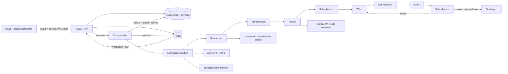

# ResearchMesh AI

A production-oriented multi-agent research platform built with **Python, LangGraph, Gemini, FastAPI, React, TypeScript, Redux Toolkit, Celery, Redis, PostgreSQL, and pgvector**.

ResearchMesh coordinates four specialized agents:

1. **Researcher** — searches the live web, inspects focus URLs, retrieves relevant prior reports, and reads arXiv papers.
2. **Analyst** — synthesizes evidence, compares competing claims, and uses Gemini's isolated Python code-execution tool for calculations.
3. **Writer** — creates a decision-ready Markdown report with a controlled source registry and citation keys.
4. **Critic** — audits factual support, citation coverage, analytical validity, uncertainty, and clarity before publication.

Each agent has a bounded self-reflection loop. The Critic can send the draft back to the Writer for a bounded number of revisions.

> The live dashboard shows agent stage changes, tool activity, evidence counts, self-review scores, and decisions. It does **not** display or store private chain-of-thought.

## Main features

- Durable LangGraph workflow with PostgreSQL checkpoints
- Gemini 3.6 Flash structured outputs with bounded retry handling
- Google Search grounding and URL context
- arXiv paper search, PDF size limits, and text extraction
- Gemini isolated Python code execution for analysis
- Researcher, Analyst, Writer, and Critic reflection loops
- Grounding-annotation allowlist, deterministic citation-key validation, and quality gating
- React + TypeScript + Redux dashboard
- Live WebSocket event stream with persisted replay and UI cancellation
- One-time WebSocket tickets instead of JWTs in connection URLs
- Celery workers with Redis broker/backend
- PostgreSQL source of truth and pgvector long-term report memory
- Tenant isolation and role-ready authentication
- Argon2 password hashing and JWT access tokens
- Docker Compose, Alembic, pytest, Ruff, ESLint, and GitHub Actions
- Offline evaluation script for single-agent versus multi-agent experiments

## Architecture



## Quick start

### 1. Create the environment file

```bash
python scripts/init_env.py
```

Edit `.env` and set at minimum:

```env
GEMINI_API_KEY=your_key_from_google_ai_studio
BOOTSTRAP_ADMIN_PASSWORD=use-a-strong-password
```

### 2. Start the platform

```bash
docker compose up --build -d
```

The `migrate` service runs Alembic before the API and worker start.

### 3. Create the administrator

```bash
docker compose run --rm api python scripts/bootstrap_admin.py
```

### 4. Open the applications

- Dashboard: `http://localhost:8080`
- FastAPI Swagger: `http://localhost:8000/docs`
- Health: `http://localhost:8000/health`
- Readiness: `http://localhost:8000/ready`

Default workspace slug: `default`

## Suggested first research

```text
Topic:
How will small language models affect enterprise AI infrastructure costs from 2026 to 2029?

Objective:
Compare inference cost, privacy, deployment complexity, accuracy tradeoffs, and the workloads where smaller models are likely to replace frontier models. Prioritize primary sources and recent technical papers.
```

## Project structure

```text
multi-agent-research-system/
├── backend/
│   ├── app/
│   │   ├── agents/          # LangGraph state, prompts, schemas, workflow
│   │   ├── api/routes/      # Auth, research, health, WebSocket APIs
│   │   ├── core/            # Settings, security, structured logging
│   │   ├── db/              # SQLAlchemy models and sessions
│   │   ├── services/        # Gemini, arXiv, events, vector memory
│   │   └── tasks/           # Celery research task
│   ├── alembic/             # Database migrations
│   ├── scripts/             # Administrator bootstrap
│   └── tests/               # Security, graph, health, prompt-boundary tests
├── frontend/
│   ├── src/
│   │   ├── app/             # Redux store and typed hooks
│   │   ├── components/      # Composer, timeline, report, sources
│   │   ├── features/        # Auth and research Redux slices
│   │   ├── pages/           # Login and dashboard
│   │   └── utils/           # Reconnecting WebSocket client
│   └── Dockerfile
├── docs/
├── scripts/
├── .github/workflows/ci.yml
└── docker-compose.yml
```

## Important accuracy statement

Multi-agent reflection can improve evidence coverage and catch errors, but no architecture guarantees that every report is more accurate than every single-model result. Use `scripts/evaluate_reports.py` with a representative benchmark before making a measured performance claim.

## Documentation

- [Complete setup](docs/SETUP.md)
- [Architecture](docs/ARCHITECTURE.md)
- [Product requirements](docs/PRD.md)
- [Security](docs/SECURITY.md)
- [Testing and evaluation](docs/TESTING.md)
- [Operations](docs/OPERATIONS.md)
- [API guide](docs/API.md)
- [Validation report](VALIDATION.md)

## Current technology references

- LangGraph overview and persistence: `https://docs.langchain.com/oss/python/langgraph/overview`
- LangGraph streaming: `https://docs.langchain.com/oss/python/langgraph/streaming`
- Gemini Google Search grounding: `https://ai.google.dev/gemini-api/docs/google-search`
- Gemini structured output: `https://ai.google.dev/gemini-api/docs/structured-output`
- Gemini code execution: `https://ai.google.dev/gemini-api/docs/code-execution`
- Gemini Embedding 2: `https://ai.google.dev/gemini-api/docs/models/gemini-embedding-2`
- FastAPI WebSockets: `https://fastapi.tiangolo.com/advanced/websockets/`
