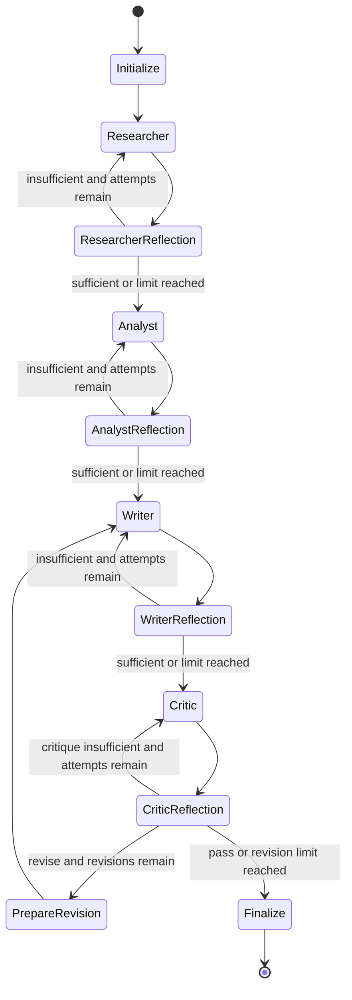

# Architecture

## 1. Design goals

- Keep HTTP requests fast and move expensive research to workers.
- Make the agent workflow explicit, observable, durable, and bounded.
- Treat LLM output as untrusted structured data that application code validates.
- Preserve evidence, events, reports, and memory in PostgreSQL.
- Use Redis as queue and event transport, not permanent business storage.
- Isolate every query by tenant.
- Show useful live activity without exposing private chain-of-thought.

## 2. Runtime components

### React dashboard

- Login and tenant selection
- Research mission composer
- Job and KPI dashboard
- Live agent timeline
- Quality score and citation count
- Markdown report viewer
- Source registry
- Redux Toolkit for application state

### FastAPI API

- JWT authentication
- One-time WebSocket ticket creation
- Tenant-scoped research CRUD
- Concurrent-job cost guard
- Event replay and WebSocket relay
- Health and dependency readiness endpoints

### Celery worker

- Owns long-running research execution
- Acknowledges tasks late
- Uses bounded execution time
- Publishes activity after persisting it
- Writes final report, sources, quality metadata, and memory

### LangGraph

The graph implements predictable routing and bounded loops:



PostgreSQL checkpointing uses the research job ID as the LangGraph thread ID.

## 3. Agent responsibilities

### Researcher

Inputs:

- Topic and objective
- Research depth
- Focus URLs
- Prior report-memory matches
- Verified arXiv extracts
- Previous research and self-reflection instructions

Tools:

- Gemini Google Search grounding
- Gemini URL context
- arXiv Atom API
- Bounded PDF extraction

Output:

- Research summary
- Key questions
- Evidence map
- Source candidates
- Unresolved questions

### Analyst

Inputs:

- Researcher evidence
- Papers
- Prior memory
- Previous analysis and self-reflection

Tool:

- Gemini isolated Python code execution

Output:

- Findings
- Comparisons
- Quantitative results
- Assumptions
- Limitations
- Confidence

### Writer

Inputs:

- Research and analysis
- Server-created source registry
- Previous draft
- Critic revision instructions

Output:

- Title
- Executive summary
- Markdown report
- Citation keys used

The server builds the source registry from Gemini URL-citation annotations, user focus URLs, and arXiv records. A model-reported URL is accepted only when it matches one of those grounded inputs. The server then replaces the reference section, so the model cannot create arbitrary final-reference links.

### Critic

Audits:

- Factual support
- Citation coverage
- Source-to-claim alignment
- Contradictions
- Analytical validity
- Uncertainty
- Completeness
- Readability

Output:

- Score
- Pass/revise verdict
- Issue lists
- Revision instructions

## 4. Data model

### tenants

Workspace boundary and top-level authorization scope.

### users

Tenant member, password hash, active state, and role.

### research_jobs

Input, status, depth, progress, current agent, reflection limits, timestamps, task ID, and failure data.

### research_events

Persisted public workflow activity with a monotonically increasing sequence.

### research_sources

Final controlled source registry, authors, type, dates, excerpts, and credibility score.

### research_reports

Final Markdown, executive summary, quality score, citations, version, and agent-iteration metadata.

### memory_chunks

Tenant-scoped report chunks and 768-dimensional Gemini Embedding 2 vectors. An HNSW cosine index supports retrieval.

### LangGraph checkpoint tables

Created by `langgraph-checkpoint-postgres` and keyed with the research job thread ID.

## 5. Live event flow

```text
Agent node
  -> database transaction saves ResearchEvent
  -> Redis pub/sub publishes serialized event
  -> FastAPI WebSocket subscriber receives event
  -> React dispatches addLiveEvent
  -> timeline updates
```

On reconnect:

1. The frontend requests a one-time WebSocket ticket with its JWT.
2. The ticket is consumed once and expires after 60 seconds.
3. FastAPI subscribes to Redis.
4. FastAPI replays database events.
5. Duplicate event IDs are ignored.
6. New events are streamed live.

## 6. Memory flow

```text
Completed report
  -> bounded overlapping chunks
  -> Gemini Embedding 2 (768 dimensions)
  -> pgvector memory_chunks

New research topic + objective
  -> embedding
  -> tenant-filtered cosine search
  -> top relevant prior report chunks
  -> Researcher and Analyst context
```

Memory is retrieval context, not authority. Prompts explicitly label it as untrusted prior team material.

## 7. Reliability and idempotency

- API creates a job before enqueueing.
- Celery task returns immediately for an already completed job.
- Derived sources are replaced on retry.
- A redelivered worker task resumes from its PostgreSQL LangGraph checkpoint.
- Report is updated by job ID.
- Events are persisted with sequence numbers.
- LangGraph checkpoints preserve node state.
- Reflection and revision loops have hard limits.
- Worker time limits prevent unbounded tasks.
- Cancellation revokes queued tasks and stops running jobs at the next node boundary.

## 8. Scaling

Scale independently:

- API replicas for REST/WebSocket traffic
- Worker replicas for research throughput
- Managed PostgreSQL with pgvector
- Managed Redis
- Static frontend CDN

For high WebSocket volume, keep Redis pub/sub or move to a durable stream/broker while retaining PostgreSQL event history.
